

<h1 align="center">PERSONAL TRIP PLANNER</h1>
<h3 align="center">Using NSW Transport APIs </h3>

  
    <section></section>
    <section></section>
    <section> <b> GROUP D PROJECT </b> </section>

  

———————— ≡₪₪₪₪≡≡₪₪₪₪≡ ————————
 
<!-- TABLE OF CONTENTS -->

  
 <b>Table of Contents</b>

  <ul>
        <li><a href="#Glance"> At A Glance</a> </li>   
        <li><a href="#GettingStarted">Getting Started</a></li>
        <li><a href="#LSTM"> LSTM Results</a></li>
        <li><a href="#Graphs">Analysis Graphs</a></li>  
        <li><a href="#Summary">Summary</a></li>    
        <li><a href="#Tech">Technologies Used</a></li>
        <li><a href="#Authors">Authors</a></li>
  </ul>

———————— ≡₪₪₪₪≡≡₪₪₪₪≡ ————————

 

## At A Glance    

    
In This project, we used NSW Public Transport API and available CSV data to feed Machine Learning algorithms for predicting Carspace availibity and Train Occupancy. 

 

    
## Getting Started

    
To view coding please look within the Notebooks folder.

Other folders will contain the resources used, as well as findings and graphs.

PDF version of the presentation is available within the Resources folder.

  
<section>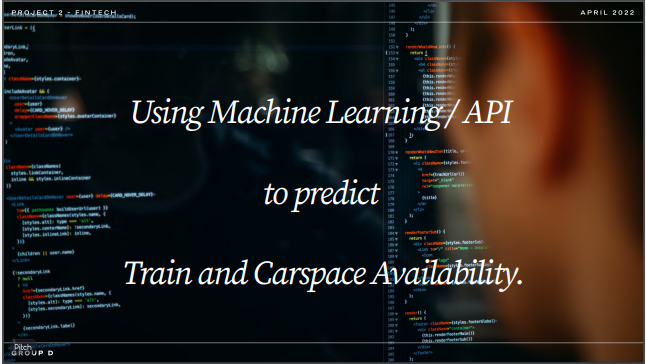</section>
      

 

    
## LSTM Results

Different configuration of LSTM model, resulted in the following charts:

  
    <section>
        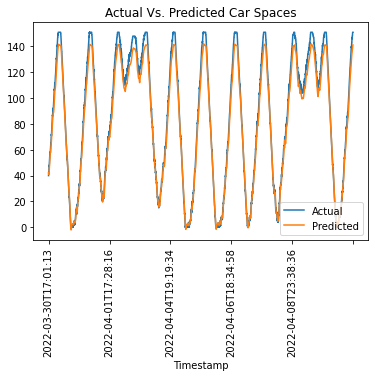
        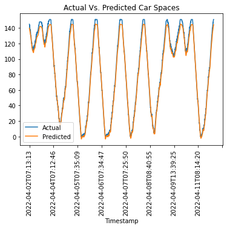
    </section>
    <section>
        
        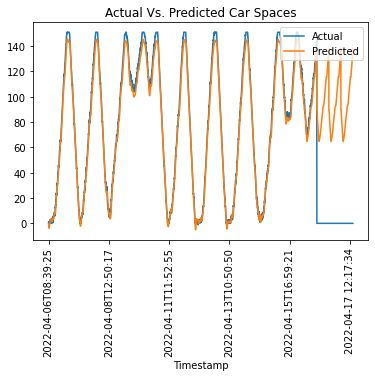
    </section>
    <section>
        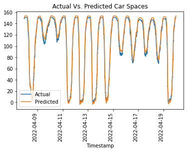
        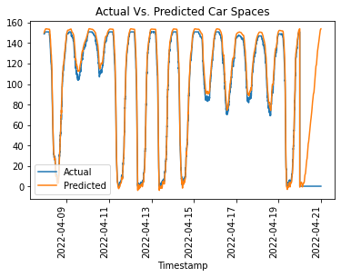
    </section>

    

(<a href="#top">Back to top</a>)

 

    
## Analysis Graphs

  
    <section>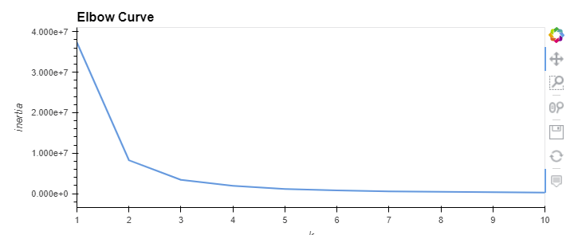</section>
    <section>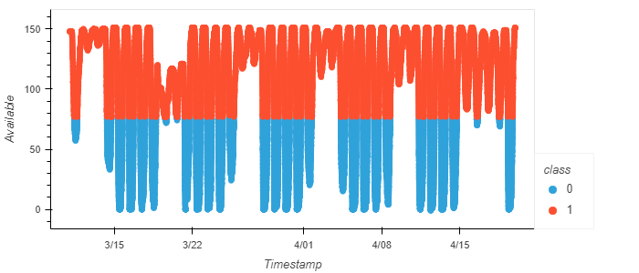</section>
    <section>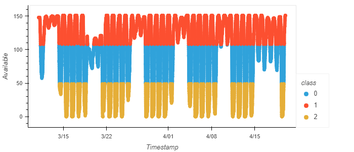</section>
    <section>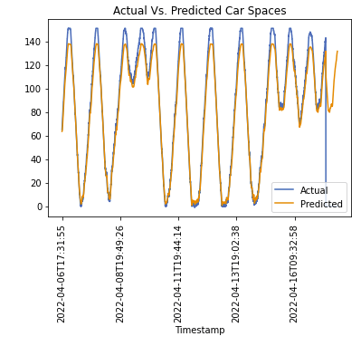</section>
    <section>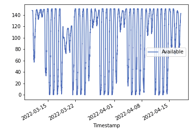</section>
    <section>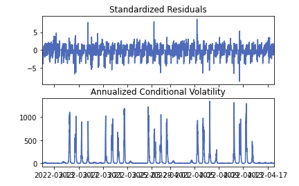</section>

    

(<a href="#top">Back to top</a>)

    

 

## Summary of Findings

    
> High Accuracy Predictions for Car Space Availability

> More machine learning models and data prep needed to predict train occupancy
    
> Utilising API's and storing real time data at intervals will give the best results for very near future predictions for both car space and trains.
    

 

    
## Technologies Used
  
    
Jupyter-lab

Python
    
Scikit-learn
    
Keras

add more here

 

    
## Authors

    
Hari Krishna Kolli

Dorothy Doutre

Ebad Salehi

Shavan Patel

(<a href="#top">Back to top</a>)

    

 
